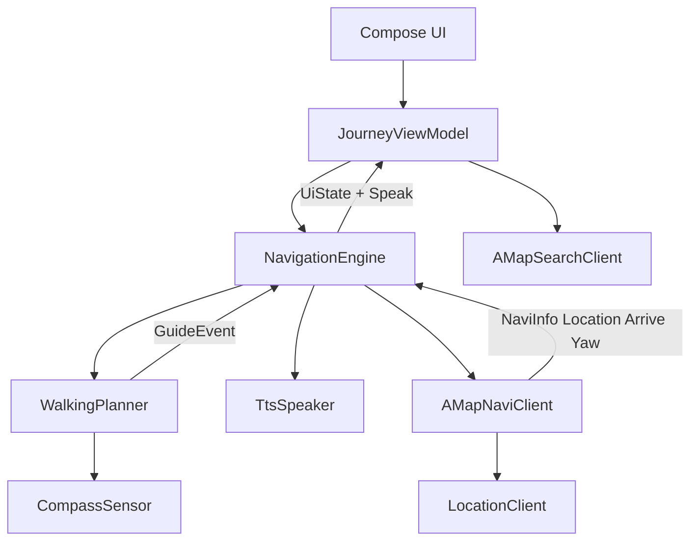
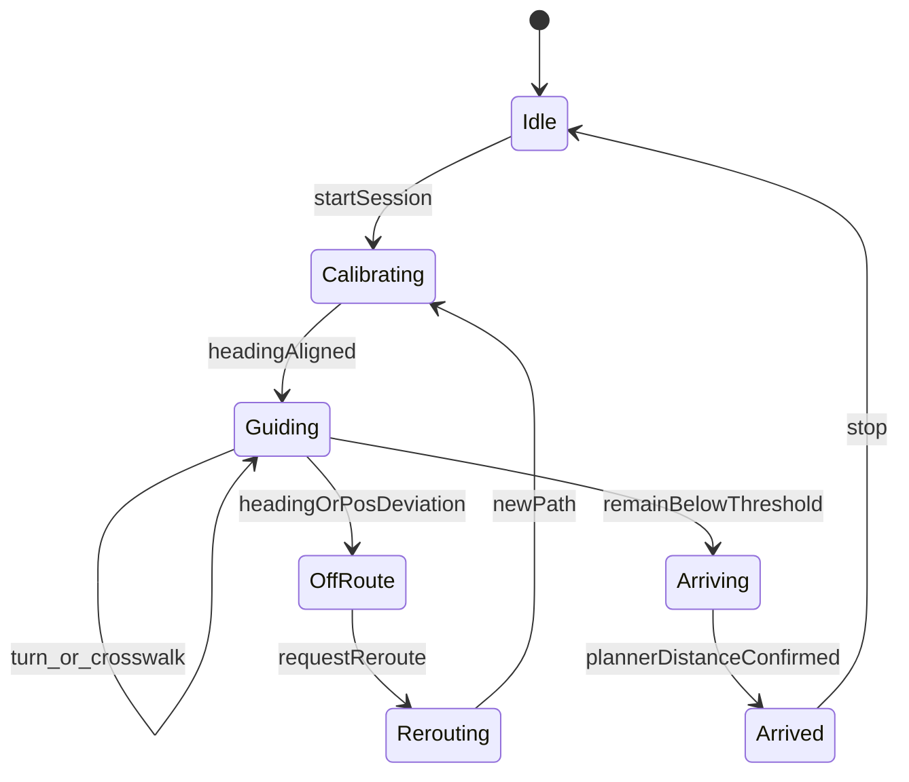

# Kotlin 无障碍步行导航规划书

- 产品定位：TalkBack / TTS 优先的 Android 步行导航
- 对标对象：豆芽看见 2.3.1 步行引擎（高德底图算路 + 自研引导）
- 技术栈：Kotlin + Jetpack Compose + 高德 Navi 10.x
- 第一期范围：搜点 → 算路 → 实时导航 → 到达
- 仓库：`e:\HU\android\nav`（当前为空工程，按全新项目建设）

---

## 1. 目标与边界

做一个 **TalkBack / TTS 优先** 的 Android 步行导航 App，行为对齐豆芽看见的步行引擎，而不是嵌高德完整导航页。

高德只负责底图、步行算路和 GPS 绑路。校准、路链引导、过街、偏航、到达确认全部由自研 `NavigationEngine` + `WalkingPlanner` 完成。

### 1.1 第一期必须有

- 定位 + 隐私合规初始化
- POI 搜索 / 逆地理
- 步行多路线算路与确认
- 实时 GPS 导航（高德绑路）
- 自研步行引导：起步校准、转弯/过街、偏航重算、二次到达确认
- TTS 播报 + 静音

### 1.2 第一期明确不做

- 公交 / 地铁、骑行、驾车
- 模拟导航（第二期再加，方便室内调试）
- 沿途 POI 播报、语音意图搜点

---

## 2. 技术选型

| 项 | 选择 |
| --- | --- |
| 语言 / UI | Kotlin 1.9+、Jetpack Compose、Material3 |
| 架构 | UI（Compose + ViewModel） / Domain（引擎） / Data（高德封装） |
| 异步 | Coroutines + `SharedFlow` / `StateFlow` |
| 地图 / 导航 | 高德 Navi 10.x（建议与对标包一致的 10.1.600）含 Search、Location、Map 3D、Navi |
| 定位 | 高德定位 + `SensorManager` 罗盘（校准 / 偏航） |
| 播报 | Android `TextToSpeech` 先打通；豆芽 `libdoyatts` 不作为一期依赖 |
| 最低系统 | API 26；无障碍按 TalkBack 一等公民做 |

高德必须先走隐私合规：`AMapNavi.setApiKey` + `NaviSetting.updatePrivacyShow/Agree` 之后才能 `AMapNavi.getInstance()`。

同进程 Kotlin 实现，**不再需要** Flutter 的 `amap_native` MethodChannel。

---

## 3. 总体架构



### 3.1 职责切分

- `AMapNaviClient`：`calculateWalkRoute`、`startNavi`、`stopNavi`、`reCalculate`，把 `AMapNaviListener` 转成 Kotlin Flow
- `NavigationEngine`：会话编排（搜路 → 开导 → 切段 → 停），不直接写 UI
- `WalkingPlanner`：无障碍状态机；SDK 的 `onArriveDestination` / `onGetNavigationText` 只当输入，不直接播
- `TtsSpeaker`：队列、打断、静音、语速；高德 SDK 语音默认关掉或白名单透传

---

## 4. 模块与包结构

单 module 起步，包按层拆，避免过早拆多 module。

```
app/src/main/java/com/hu/nav/
  NavApp.kt
  di/                 // 手工或 Hilt
  data/amap/
    AMapNaviClient.kt
    AMapSearchClient.kt
    AMapLocationClient.kt
    AMapPrivacy.kt
  data/sensor/
    CompassRepository.kt
  domain/model/       // GeoPoint, Poi, WalkPath, WalkStep, WalkLink
  domain/nav/
    NavigationEngine.kt
    WalkingPlanner.kt
    GuideEvent.kt
    NavigationSession.kt
  domain/tts/
    TtsSpeaker.kt
  ui/search/
  ui/route/
  ui/journey/
  ui/common/a11y/
```

地图用 `AndroidView` 嵌 `AMapNaviView`（或 `MapView` + 路线 overlay）。

**视觉地图是辅助，主通道是 TTS + 大按钮 + contentDescription。**

---

## 5. 核心数据模型

- `Poi`：id、name、lat/lng、address
- `WalkPath`：距离、时间、steps、polyline、过街点列表
- `WalkStep`：instruction、orientation、links、remainDistance
- `WalkLink`：polyline、length、roadName、facility（人行横道 / 天桥 / 隧道 / 电梯）
- `NaviTick`：绑路后坐标、bearing、curStep / curLink、routeRemain、iconType
- `GuideEvent`：
  - `CalibrationStart` / `CalibrationComplete`
  - `ApproachingTurn`、`TurnEntered` / `TurnEnded`
  - `Crosswalk`
  - `HeadingDeviation`、`OffRoute`、`Reroute`
  - `ApproachingDestination`、`Arrived`

步行路线优先用高德 `AMapNaviPath` 的 step / link 转成上述模型。过街信息从 link 类型 / 道路设施字段抽取。

---

## 6. WalkingPlanner 状态机（一期核心）



规则对齐豆芽，不抄高德默认播报：

1. **起步校准**：开导后先报朝向，用地磁 heading 与当前 link `expectedBearing` 比较，偏差小于阈值（建议 30°）才进入 Guiding。校准期丢掉转弯 / 设施 / SDK 语音。
2. **路链引导**：用 `NaviTick.curLink` + 剩余距离，在进入弯前 / 中 / 后各播一次；过街单独事件，过街后报下一条路名。
3. **偏航**：位置偏离 polyline 超过阈值，或 heading 连续偏离 `expectedBearing` → `OffRoute` → `reCalculateWalkRoute`。
4. **到达**：忽略单独的 SDK `onArriveDestination`。剩余直线距离 + 绑路剩余距离双条件满足才 `Arrived`。接近终点时改为「方向 + 距离」低频播报。
5. **SDK 语音**：默认 `setUseInnerVoice(false)`。若个别转向音要保留，用白名单，避免和自研播报抢话。

阈值（校准角、偏航距离、到达半径）全部放进 `NavigationConfig`，方便路测调整。

---

## 7. 页面与用户流程

1. **搜索页**：输入关键词 → POI 列表（TalkBack 可读距离 / 方位）→ 选点
2. **选路页**：展示 1～3 条步行路线摘要（距离、过街次数、预计时间）→ 确认出发
3. **导航页**：地图缩小为背景；顶部剩余距离 / 路名；底部「停止 / 静音 / 重报当前位置」；全程 TTS
4. **设置**：语速、到达阈值、是否开启罗盘校准（开发期可关）

无障碍约束：

- 所有主操作可达
- 焦点顺序稳定
- 播报不依赖屏幕文字颜色或图标

---

## 8. 高德接入要点

- Key、SHA1、包名配置在 `AndroidManifest` 与高德开放平台
- 权限：`ACCESS_FINE_LOCATION`、`ACCESS_COARSE_LOCATION`、前台服务（导航中定位）、通知
- 算路：`AMapNavi.calculateWalkRoute(from, to)`，监听 `onCalculateRouteSuccess`
- 开导：`startNavi(GPSNaviMode)`；停止：`stopNavi()` + `destroy`
- 回调：`onNaviInfoUpdate`、`onLocationChange`、`onArriveDestination`、`onReCalculateRouteForYaw`、`onCalculateRouteFailure`
- 导航中使用 `foregroundServiceType="location"`，避免后台被杀

---

## 9. 分期交付

### P0 工程骨架（约 2–3 天）

- 创建 Compose 工程、Hilt、权限、高德隐私与 Key
- 能显示地图和当前位置

### P1 搜点与算路（约 3–4 天）

- Search POI + 逆地理
- `calculateWalkRoute`，选路页能读出距离 / 时间
- 模型转换：`AMapNaviPath` → `WalkPath` / `WalkStep` / `WalkLink`

### P2 实时导航壳（约 3 天）

- `startNavi` + `NaviTick` Flow
- 导航页 UI、停止、TTS 直接播 step instruction（先可用，后续被 Planner 替换）
- 前台服务保活

### P3 WalkingPlanner（约 5–7 天，主风险）

- 校准、转弯、过街、偏航重算、二次到达
- 关掉 SDK 内置语音，全部改走 `GuideEvent` → TTS
- 用固定测试路线（含斑马线、直角弯）调阈值

### P4 打磨（约 3 天）

- TalkBack 走查、静音、重报当前位置、语速
- 弱 GPS / 室内入口 / 到达误报回归
- 日志格式对齐豆芽 `WalkingPlanner: ...`，方便对照行为

**第二期再加**：模拟导航、公交、POI 沿途播报、语音搜点。

---

## 10. 风险与对策

- **步行 link 设施字段不全**：过街可能抽不到。对策：用道路名变化 + 人行横道 POI / 路口类型兜底；没有就只报「过马路」。
- **罗盘在钢结构 / 地铁口失真**：校准超时则降级为「不校准，只靠绑路距离」。
- **到达误报**：SDK 到点偏早。必须 Planner 二次确认，阈值可配置。
- **高德步行配额 / Key**：个人 Key 限制多，先小流量验证。
- **无源码可对照**：校准角、偏航距离、到达半径只能路测，必须做成 `NavigationConfig`。

---

## 11. 验收标准（第一期）

- 搜到 POI，算出步行路线并开导
- 开导后先校准朝向，再开始报转弯
- 斑马线或路口能听到过街 / 路名
- 故意走偏能重算
- 到达附近不会过早结束，确认后才报到达并停导
- TalkBack 可独立完成：搜索 → 出发 → 停止
- 静音后不再出声，取消静音后恢复
